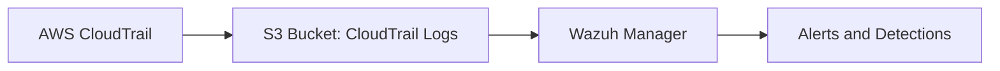

# Forwarding AWS CloudTrail Logs to Wazuh SIEM

This repository documents a production-grade configuration to forward **AWS CloudTrail logs** to **Wazuh SIEM** for security monitoring, compliance, and detection engineering.

It includes:
- CloudTrail and S3 configuration
- IAM policies for log access
- Wazuh S3 integration setup
- Sample Wazuh detection rules

---

## Architecture Overview

##  S3 Bucket Policy

The `bucket-policy.json` file defines secure access controls to enable seamless integration between **AWS CloudTrail** and **Wazuh**.

### 🔹 1. CloudTrail to Write Logs
- Grants **CloudTrail** permission to upload (`s3:PutObject`) logs into the S3 bucket.
- Ensures logs are written with `"bucket-owner-full-control"` so your AWS account retains ownership.
- Uses a specific `SourceArn` to restrict this permission to your intended CloudTrail trail only.

### 🔹 2. CloudTrail to Verify Bucket Permissions
- Enables `s3:GetBucketAcl` so CloudTrail can confirm ACL ownership is applied properly before writing.

### 🔹 3. Wazuh Manager Role to Read Logs
Grants **Wazuh's IAM Role** permissions to:

- `s3:ListBucket` – to locate log files.
- `s3:GetObject` – to download logs for analysis.
- `s3:DeleteObject` *(optional)* – if you use a cleanup process after parsing logs.

> All access is scoped to the specified **bucket** and **prefix path** only for least privilege.

📄 **View the policy**: [`cloudtrail/bucket-policy.json`](cloudtrail/bucket-policy.json)

---

## 👤 Wazuh IAM Policy

The [`iam/wazuh-manager-policy.json`](iam/wazuh-manager-policy.json) file defines the permissions Wazuh needs to read CloudTrail logs from S3.

- `s3:ListBucket` — lets Wazuh find available log files.
- `s3:GetObject` — lets Wazuh download logs for processing.
- `s3:DeleteObject` — optional; used only if Wazuh is configured to delete logs after parsing.

📄 View the policy: [`iam/wazuh-manager-policy.json`](iam/wazuh-manager-policy.json)

